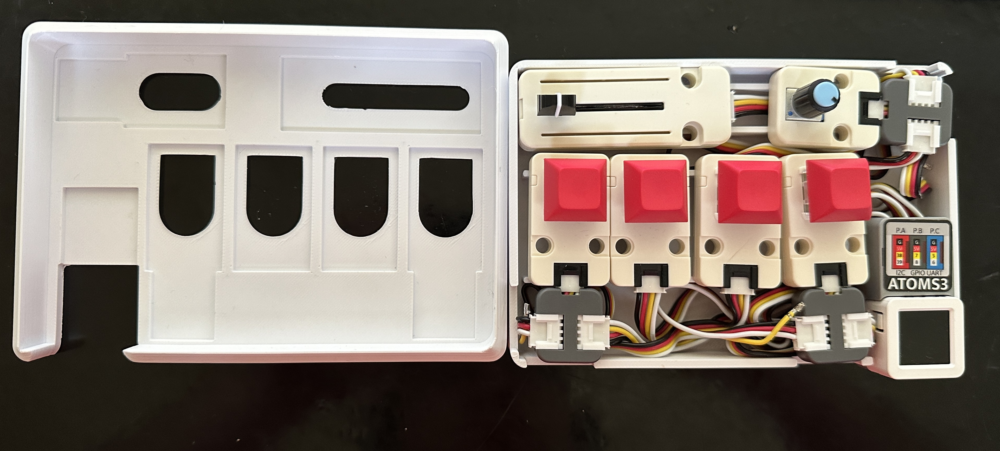
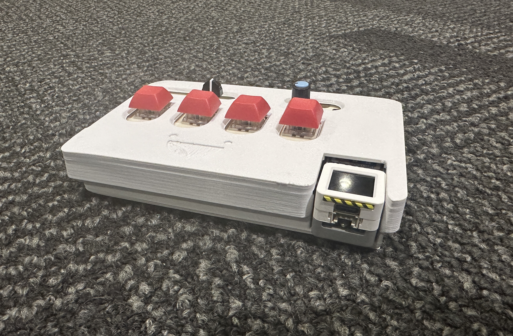
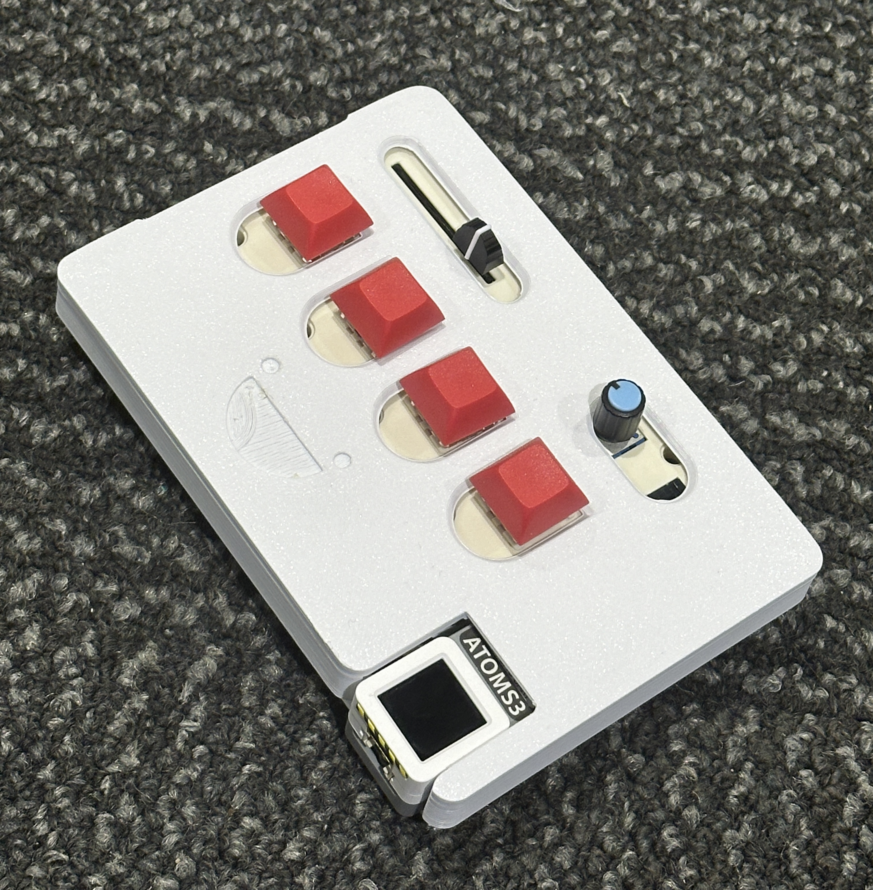

# **Physical Pattern Design Tool**
A microkeyboard that lets you generate 4 different types of pattern and control those pattern to achieve various results. I really liked how much you can do with the randomness effect in processing and I thought it would be interesting to have a microkeyboard that basically lets you controll that randomness, the values of the Sin Waves generated by processing. Demo Video Submitted on Canvas. [Thonny Code](https://github.com/IlyaHakobyan/Ilya-s-Repository/blob/0d938a19a24c67a4d5378828ce04c9ad26f44f79/Final%20Assignment/Adv%20Prot%20Final%20Inputs.py) , [Processing Code](https://github.com/IlyaHakobyan/Ilya-s-Repository/blob/a849fd7a8e8fc8b96cf67617b4029983851b9a98/Final%20Assignment/Sample_Sketch_Test.pde) , **[Demo Videos](https://drive.google.com/drive/folders/1u9Ew5-iZN_sU-13le6jb6QVWzYz-k5we?usp=sharing)**

### How it works
6 components - a potentiometer, slider and 4 switches/keys. These are all conected to an AtomS3 Board extention. and put in a 3D printed Box. The values of those 6 components are first read and mapped in [Thonny](https://github.com/IlyaHakobyan/Ilya-s-Repository/blob/0d938a19a24c67a4d5378828ce04c9ad26f44f79/Final%20Assignment/Adv%20Prot%20Final%20Inputs.py) and then the values that thonny has are read by [Processing](./) and later used to control the pattern values.
#### Component Links
[Slider](https://shop.m5stack.com/products/fader-unit-with-b10k-potentiometer-sk6812) , 
[Potentiometer](https://shop.m5stack.com/products/encoder-unit) , 
[Buttons](https://shop.m5stack.com/products/mechanical-key-button-unit) , 
[Extension Connectors](https://shop.m5stack.com/products/grove-t-connector-5pcs-a-pack
)

### Diagram

### Process Photos
Biggest pain point here was to fit everything in snugly and without having things wiggle or the top part of the box come out because there are a lot of wires. I'd say there probably is a better way of doing this because the amount of wires was a lot to handle and made it much harder and frustrating than it should have been. The box was 3D printed, 3rd attempt. I Just measured the component sizes and recreated them in CAD. It wasn't too hard since I didn't make the cutouts too complex and precise since there's room around the components.

## **Final Physical Prototype**

