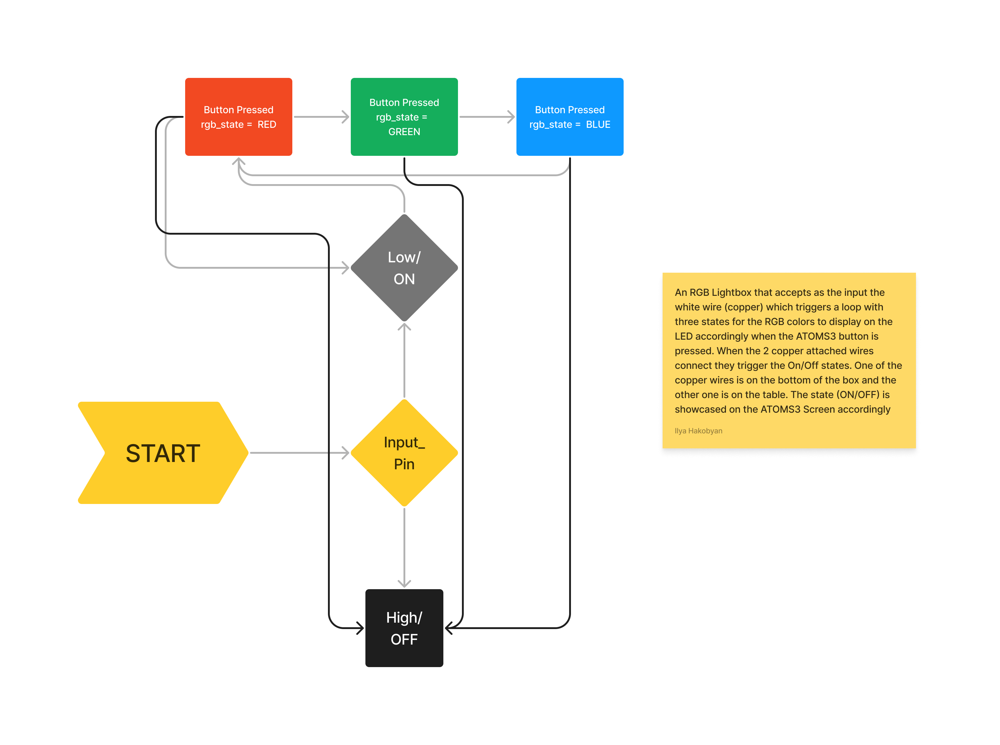

# RGB Lightbox
Rgb Light strip that's connected to my computer through the ATOMS3 microprocessor. I've put the strip in a box, cut three holes in it to make the light visible from the box and attached two copper pieces that serve as input for it, one on the bottom of the box and one on the desk. So that when you put the item on the desk it turns on/of . Second input is the button on the microprocessor that changes the colors of the light.

