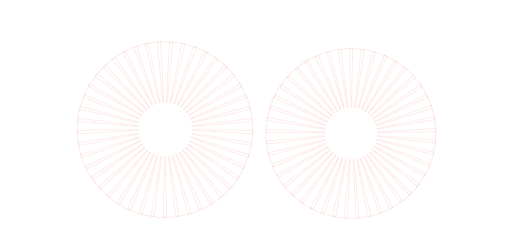
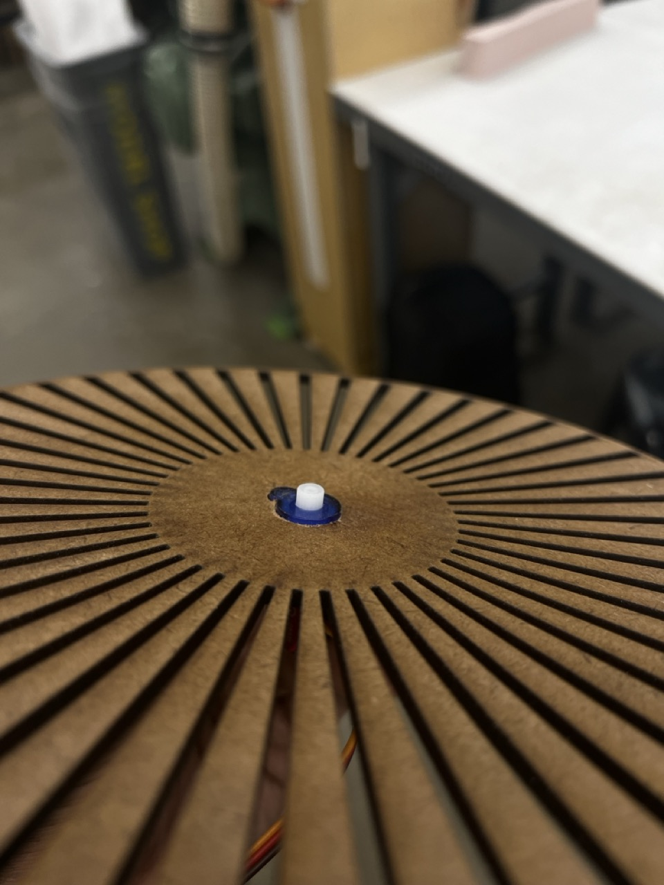

# Spinning Moire Pattern
Attaching two disks with different patterns on top of each other on a spinning servo, the servo spins one of the disks but not the other since since the other one is attached directly to the body of the servo and not the wheel. The spinning of those two patterns create a Moire pattern illusion of both of those layers spinning. 

## Process Images
Laser Cutting and attaching the first disk to the body of the servo

